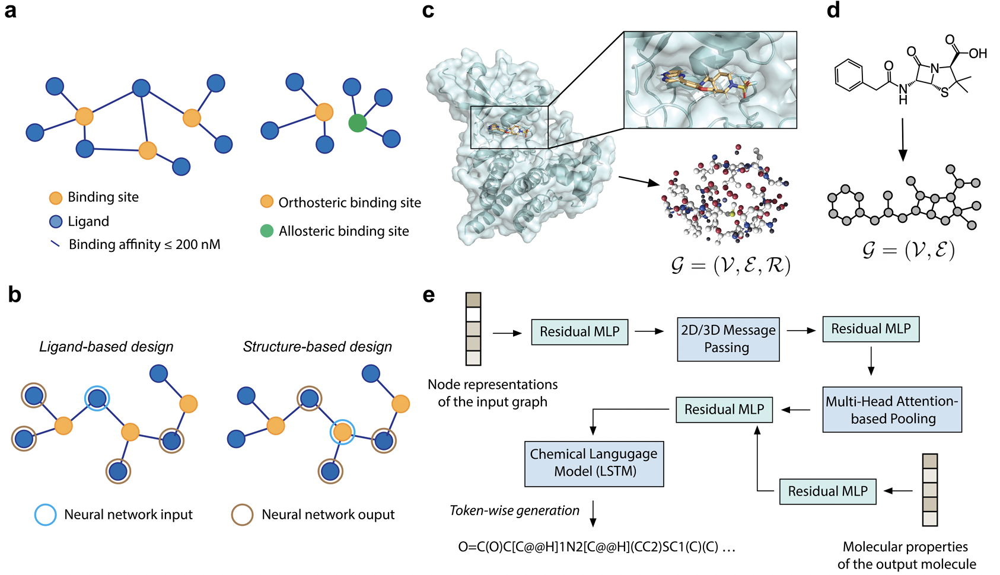

# Deep interactome learning for de novo drug design

[](https://www.python.org)
[](https://pytorch.org)
[](https://www.rdkit.org/)
[](https://github.com/psf/black)
[](https://lbesson.mit-license.org/)
[](https://doi.org/10.26434/chemrxiv-2023-cbq9k)



This repository contains a reference implementation to preprocess the data, as well as to train and apply the de novo design models introduced in Kenneth Atz, Leandro Cotos, Clemens Isert, Maria Håkansson, Dorota Focht, David F. Nippa, Mattis Hilleke, Michael Iff, Jann Ledergerber, Carl C. G. Schiebroek, Jan A. Hiss, Daniel Merk, Petra Schneider, Bernd Kuhn, Uwe Grether, & Gisbert Schneider, Journal, X, XX (2023).

## 1. Environment
Create and activate the dragonfly environment. 

```
cd envs/
conda env create -f environment.yml
conda activate dragonfly
poetry install
```

Add the "dragonfly path" as PYTHONPATH to your `~/.bashrc` file. 

```
export PYTHONPATH="${PYTHONPATH}:<YOUR_PATH>/dragonfly_gen/"
```

Source your `~/.bashrc`.

```
source `~/.bashrc`
conda activate dragonfly
```

Test your installation by running `test_pyg.py`.

```
python test_pyg.py 
>>> torch_geometric.__version__: 2.3.0
>>> torch.__version__: 1.13.1
>>> rdkit.__version__: 2022.09.5
```

## 2. Sampling from a binding site

To preprocess the binding site for a given protein stored as a PDB file and its ligand as an SDF file in the `input/` directory, use the following commands:

```
cd genfromstructure/
ls input/
>>> 3g8i_ligand.sdf 3g8i_protein.pdb
```

Next, preprocess the files using `preprocesspdb.py`:
```
python preprocesspdb.py -pdb_file 3g8i_protein -mol_file 3g8i_ligand -pdb_key 3g8i
>>> Number of embedded atoms: 178 / 178
>>> Writing input/3g8i.h5
```

After preprocessing, apply Dragonfly using `sampling.py`:
```
python sampling.py -config 701 -epoch 151 -T 0.5 -pdb 3g8i -num_mols 100
Sampling 100 molecules:
100%|██████████████████████████████████████████████████████████████████████████████████████████████████████████████████████|  100/100 [00:06<00:00, 14.31it/s]
Number of valid, unique and novel molecules: 88
```

The generated molecules are saved in the `output/` directory:
```
ls output/
3g8i.csv
```

For generating SELFIES run the following command:
```
python sampling.py -config 901 -epoch 194 -T 0.5 -pdb 3g8i -num_mols 100
100%|██████████████████████████████████████████████████████████████████████████████████████████████████████████████████████|  100/100 [00:08<00:00, 12.13it/s]
Number of valid, unique and novel molecules: 100
```

The generated molecules are saved in the `output/` directory:
```
ls output/
3g8i.csv
```

## 3. Sampling from a template ligand

In the `genfromligand/` directory, Dragonfly can be applied to generate molecules based on a template SMILES string.
If you run the program for the first time, create directory 'output' first:
```
mkdir output
```
Use the following command:
```
cd genfromligand/
python sampling.py -config 603 -epoch 305 -T 0.5 -smi_id rosiglitazone -smi "CN(CCOC1=CC=C(C=C1)CC2C(=O)NC(=O)S2)C3=CC=CC=N3" -num_mols 100
Here is your template SMILES: CN(CCOC1=CC=C(C=C1)CC2C(=O)NC(=O)S2)C3=CC=CC=N3
Sampling 100 molecules:
100%|██████████████████████████████████████████████████████████████████████████████████████████████████████████████████████|  100/100 [00:05<00:00, 19.28it/s]
Number of valid, unique and novel molecules: 80
```

The generated molecules are saved in the `output/` directory:
```
ls output/
rosiglitazone.csv
```

For generating SELFIES run the following command:
```
python sampling.py -config 803 -epoch 341 -T 0.5 -smi_id rosiglitazone -smi "CN(CCOC1=CC=C(C=C1)CC2C(=O)NC(=O)S2)C3=CC=CC=N3" -num_mols 100
100%|██████████████████████████████████████████████████████████████████████████████████████████████████████████████████████|  100/100 [00:08<00:00, 12.13it/s]
Number of valid, unique and novel molecules: 100
```

The generated molecules are saved in the `output/` directory:
```
ls output/
rosiglitazone.csv
```


## 4. Rank generated molecules based on pharmacophore similarity to the template

To rank the generated molecules based on pharmacophore similarity to the template, navigate to `ranking/qsar/` and use the following command:
```
cd ranking/qsar/
python cats_similarity_ranking.py -smi_file ../../genfromligand/output/rosiglitazone.csv -query "CN(CCOC1=CC=C(C=C1)CC2C(=O)NC(=O)S2)C3=CC=CC=N3"
100%|███████████████████████████████████████████████████████████████████████████████████████████████████████████████████████████████████████████████████████████████| 80/80 [00:00<00:00, 631.86it/s]
The ranked molecules are stored here: ../../genfromligand/output/rosiglitazone_cats.csv
```

## 5. License
The software was developed at ETH Zurich and is licensed by the AGPL-3.0 license, i.e. described in `LICENSE`.

## 6. Citation
```
@article{atz2023deep,
  title={Deep interactome learning for de novo drug design},
  author={Atz, Kenneth and Mu{\~n}oz, Leandro Cotos and Isert, Clemens and H{\aa}kansson, Maria and Focht, Dorota and Hilleke, Mattis and Nippa, David F and Iff, Michael and Ledergerber, Jann and Schiebroek, Carl CG and Grether, Uwe and Schneider, Gisbert and others},
  year={2023}
}
```


